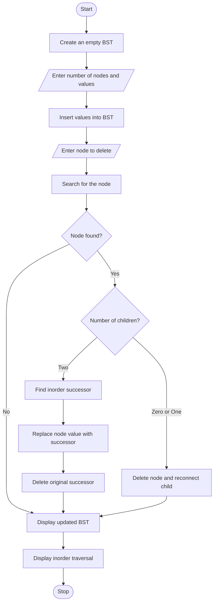

## Flowchart

```mermaid
flowchart TD
    A([Start]) --> B[Create an empty BST]
    B --> C[/Enter number of nodes and values/]
    C --> D[Insert values into BST]
    D --> E[/Enter node to delete/]
    E --> F[Search for the node]
    F --> G{Node found?}

    G -- No --> H[Display updated BST]
    G -- Yes --> I{Number of children?}

    I -- Two --> J[Find inorder successor]
    J --> K[Replace node value with successor]
    K --> L[Delete original successor]

    I -- Zero or One --> M[Delete node and reconnect child]

    L --> H
    M --> H
    H --> N[Display inorder traversal]
    N --> O([Stop])
```
