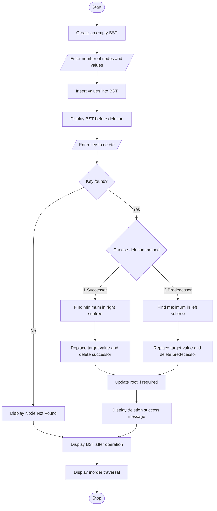

## Modified Flowchart

```mermaid
flowchart TD
    A([Start]) --> B[Create an empty BST]
    B --> C[/Enter number of nodes and values/]
    C --> D[Insert values into BST]
    D --> E[Display BST before deletion]
    E --> F[/Enter key to delete/]
    F --> G{Key found?}

    G -- No --> H[Display Node Not Found]
    H --> M[Display BST after operation]

    G -- Yes --> I{Choose deletion method}
    I -- 1 Successor --> J[Find minimum in right subtree]
    I -- 2 Predecessor --> K[Find maximum in left subtree]

    J --> L[Replace target value and delete successor]
    K --> N[Replace target value and delete predecessor]

    L --> O[Update root if required]
    N --> O

    O --> P[Display deletion success message]
    P --> M

    M --> Q[Display inorder traversal]
    Q --> R([Stop])
```
